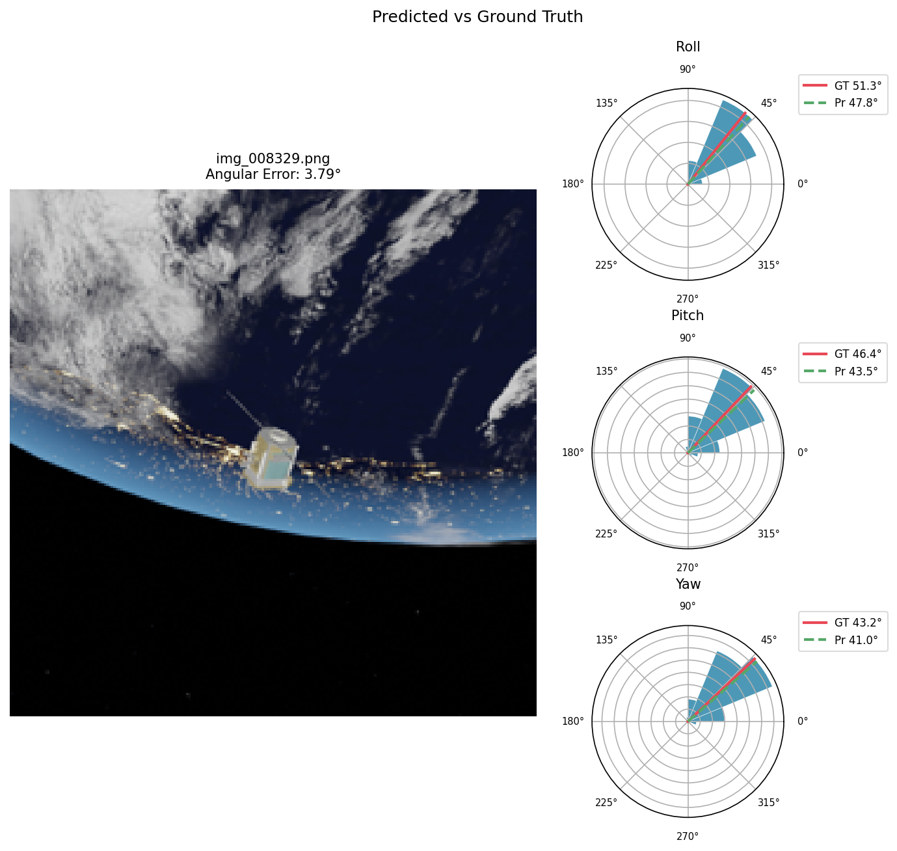
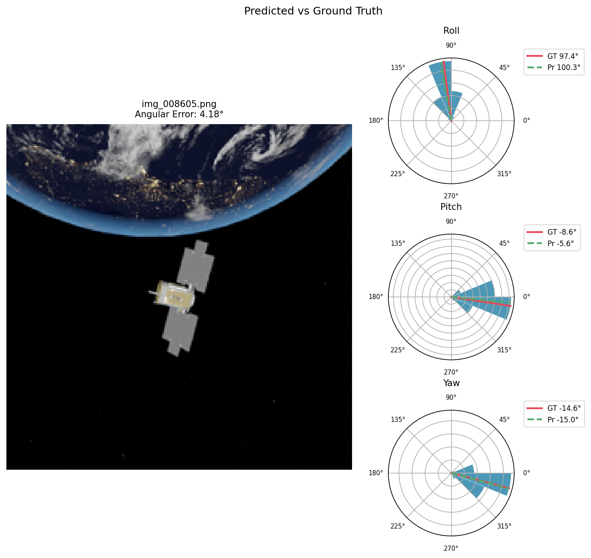
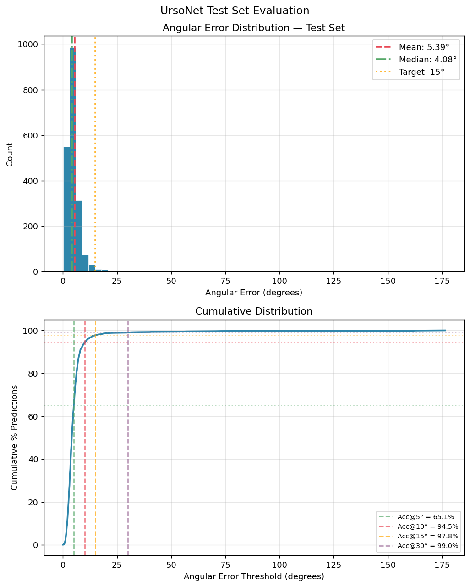
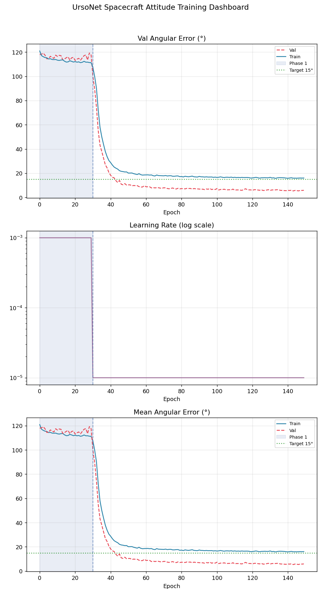

# Хиймэл оюунд суурилсан бага оврын хиймэл дагуулын чиглэл тогтоох системийн оновчлол

**Optimization of an Artificial Intelligence-Based Attitude Determination System for Small Satellites**

Бакалаврын төсөл — Оргилсайхан Балжинням

---

## Ерөнхий
<p align="justify">
Сансрын хөлгүүдийн ойртолт, залгалт (RVD), сансрын хог хаягдлыг зайлуулах ажиллагаанд хиймэл дагуулын чиглэлийг өндөр нарийвчлалтай тодорхойлох шаардлага нэмэгдэж байна. Гэвч сансрын орчны гэрэлтүүлгийн огцом өөрчлөлт болон объектын тэгш хэмт бүтэц нь уламжлалт геометрийн аргуудын нарийвчлалыг бууруулдаг. Энэхүү судалгааны ажлаар ResNet-50V2 суурьтай UrsoNet архитектур ашиглан дүрсэнд суурилсан чиглэл тогтоох системийг боловсруулав. Blender болон Python орчинд CloudSat хиймэл дагуулын 10,000 фото-реалистик синтетик зураг үүсгэж өгөгдлийн сан бүрдүүлэн, өгөгдөл баяжуулалт болон хоёр үе шаттай сургалтын аргаар загварыг сургаж туршив.
</p>
Төсөл нь дараах үе шатуудыг хамардаг:

1. **Фото-реалистик синтетик өгөгдлийн сан үүсгэх** — BlenderProc ашиглан бодит байдлын дүрслэл бүхий фото-реалистик зураг үүсгэх.
2. **Загвар сургах** — UrsoNet архитектурыг хоёр үе шаттай сургах.
3. **Амьд демо** — TensorFlow.js ашигласан хөтчийн дээрх (browser) таамаглалын демо, GitHub Pages дээр хөгжүүлсэн.

---

## Төслийн бүтэц

```
.
├── CloudSat.glb                              # CloudSat хиймэл дагуулын 3D загвар
├── Resnet_train_script_v3_ursonet.ipynb      # Үндсэн сургалтын тэмдэглэл (UrsoNet)
├── dataset_generation_sat_v10_sun_moon.py     # BlenderProc нар+сар дүрслэх хувилбар
├── renumber_csv.py                           # CSV дугаарлах хэрэгсэл
├── renumber_images.py                        # Зураг дугаарлах хэрэгсэл
├── command_conda_env.txt                     # Conda орчны тохиргоо
├── command_blender.txt                       # Blender тушаалын лавлах
├── docs/                                     # GitHub Pages демо
│   ├── index.html                            # Демо хуудас
│   ├── app.js                                # Таамаглалын логик (TF.js)
│   ├── style.css                             # Загварчлал
│   ├── demo_data.json                        # 12 тест зураг ба үнэн зөв шошго
│   ├── images/                               # Демогийн тест зургууд
│   └── model_tfjs/                           # Хөрвүүлсэн TF.js загварын файлууд
│       ├── model.json                        # TF.js загварын граф
│       ├── group1-shard*.bin                 # Загварын файл
│       └── savedmodel/                       # Эх Keras SavedModel экспорт
├── softmax_30_sar_prediction.png             # Таамаглалын дүрслэл
├── softmax_55_sar_prediction.png             # Нэмэлт таамаглалын үр дүн
├── error_analysis.png                        # Өнцгийн алдааны тархалт
├── training_dashboard.png                    # Сургалтын үзүүлэлтүүд
└── LICENSE
```

---

## Төслийн демо

GitHub Pages дээр хөгжүүлсэн хөтчийн демо. Сургасан загвар (HuggingFace дээр хостолсон)-ыг ачаалж, тест сансрын зураг дээр таамаглал гүйцэтгэнэ. Эйлерийн өнцгийн таамаглалыг үнэн зөв утгатай харьцуулж харуулна.

### Боломжууд

- TF.js загварыг хөтөч дотор шууд ачаална — сервер шаардлагагүй
- 3-н өнцөгийн таамаглалуудыг үнэн зөв утгуудтай харьцуулж харуулна
- Өнцөг тус бүрийн алдаа ба нийт өнцгийн алдааг (geodesic зай) харуулна
- Softmax тархалтын дебаг гаралтыг харуулна

### Загварын хостинг

Хөрвүүлсэн TF.js загвар HuggingFace дээр хостлогдсон:

```
https://huggingface.co/baljkaaorgilsaikhan/spacecraft-attitude-thesis/resolve/main/model.json
```

---

## Загвар сургах

Сургалтын тэмдэглэл `Resnet_train_script_v3_ursonet.ipynb` нь **UrsoNet** архитектурыг (Proença & Gao, 2020) ашигласан ба — **ResNet50V2** нуруу дээр тулгуурласан.

### Архитектур

| Бүрэлдэхүүн | Дэлгэрэнгүй |
|---|---|
| Нуруу | ResNet50V2 (ImageNet урьдчилан сургасан, нарийвчлалын үед BatchNormalization хөлдөөсөн) |
| Толгой | 3 бие даасан Dense(16, softmax) — Эйлерийн тэнхлэг тус бүрт (Ролл, Пич, Яо) |
| Гаралт | 48 утга (3 × 16 softmax хайрцаг), circular mean-ээр кватернион руу хөрвүүлнэ |
| Алдаа | Тэнхлэг тус бүрийн categorical cross-entropy, Гауссын зөөлөн шошго (σ = 22.5°) |
| Оптимизатор | Adam, суралцах хурдын хуваарилалт ба градиент хайчлалттай |
| Фреймворк | TensorFlow 2.10 / Keras |

### Хоёр үе шаттай сургалт

- **Үе шат 1 — Толгойн эхний сургалт** (30 үе): зөвхөн ангилах толгойг lr=1e-3-аар сургана
- **Үе шат 2 — Бүрэн нарийвчлал** (120 үе): ResNe50V2 BottleNeck-тэйгээр нээлттэй болгоно, lr=1e-5 эрт зогсоолттой

---

## Өгөгдлийн сан үүсгэх

[BlenderProc](https://github.com/DLR-RM/BlenderProc) болон Cycles рендерер (CUDA-ар GPU хурдасгасан) ашиглан хиймэл зургуудыг үүсгэнэ. `dataset_generation_sat_v10_sun_moon.py` скрипт нь энэ репод лавлах болон орсон байна.

### Гол онцлогууд

- **Нарны виддиск** — Бодит өнцгийн диаметртэй (0.53°) ялгаруулах бөмбөлцгийг дулаан цагаан (5778K)
- **Кадр бүрт нарны чиглэл** — Олон төрлийн сүүдэр үүсгэхийн тулд кадр бүрт сүүдэр өөрчлөгддөг
- **Линзийн гэрэл** — Фотorealistic bloom-ын хувьд compositor-оор удирдагдсан цацраг ба манан гэрэл
- **Дэлхийн дэвсгэр** — Өдөр/шөнийн/үүлэн текстур 2K ба 8K нарийвчлалтай
- **CSV гаралт** — Баганууд: `image_name, qw, qx, qy, qz, tx, ty, tz, sun_dx, sun_dy, sun_dz`

---

## Үр дүн

### Таамаглалын дүрслэл

Үнэн зөв утгатай харьцуулсан softmax таамаглалын жишээ:





### Алдааны шинжилгээ

Тест зургууд дээрх өнцгийн алдааны тархалт:



### Сургалтын үр дүнгийн үзүүлэлтүүд

Хоёр үе шатын сургалт болон баталгаажуулалтын үзүүлэлтүүд:



---

## Орчны тохиргоо

### Шаардлагууд

- **Python** 3.8+
- **TensorFlow** 2.10 GPU дэмжлэгтэй (CUDA)
- **BlenderProc** (өгөгдлийн сан үүсгэхэд)
- **Blender** 3.x+ (BlenderProc-оор дуудагдана)

### Гол хамаарлууд

```
tensorflow==2.10
keras
numpy
pandas
Pillow
imageio
blenderproc
```

### Эхлэх

```bash
conda activate tf_gpu
jupyter lab
# Resnet_train_script_v3_ursonet.ipynb-ийг нээнэ үү
```

---

## Лавлах

- Sharma, S., Beier, C., D'Amico, S. (2019). *Spacecraft Pose Estimation Dataset (SPEED)*. [[Өгүүлэл]](https://arxiv.org/abs/1907.04195)
- Proença, J., Gao, Y. (2020). *Deep Learning for Spacecraft Pose Estimation from Photorealistic Rendering*. [[Өгүүлэл]](https://arxiv.org/abs/2004.05076)

---

## Лиценз

Энэхүү төсөл нь бакалаврын судалгааны хэсэг юм. Бүх эрх хуулиар хамгаалагдсан <3.
